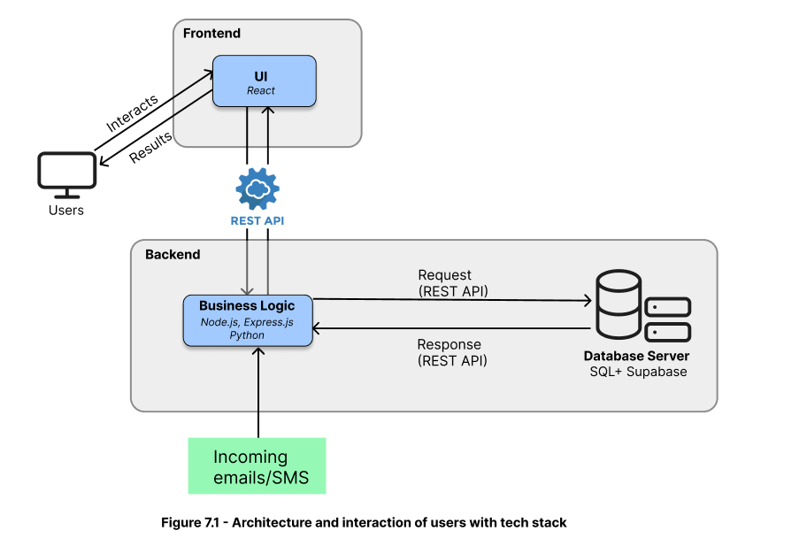

# NotifAI

A Notification-as-a-Service Web-App

## Table of Contents
- [Overview](./README.md#Overview)
- [Setup and Installation](./documentation/setup.md)
- [Code Explanation](./documentation/code_explanation.md)
- [Backend API (Using Swagger) Documentation](./documentation/backend_api.md)

### Overview

NotifAI is a Notification as a Service (NaaS) platform designed to consolidate notifications from a multiple channels, such as in-app messages, email, and SMS, into a single, central inbox. This solves the problem of scattered communications, where a user might have to check multiple apps or channels to stay informed. 

#### Architecture

##### 1. High Level Diagram

##### 2. Main Components

###### 1. Front-End (View Layer)
- Technology: A web-based UI built with a JavaScript framework (e.g., React or a similar library) plus modern CSS libraries for styling.

- Responsibilities:
    - Renders an intuitive user interface, including login pages, inbox view, notification composition forms, etc.
    - Sends API requests to the backend for actions like creating or fetching notifications.
    - Displays notifications in a unified inbox, allowing filtering or searching.

###### 2. Back-End (Controller Layer)
- Technology: Node.js with Express (or a similar REST framework).

- Responsibilities:
    - Acts as the central point for business logic—routing requests, validating inputs, handling authentication.
    - Communicates with the database (via an ORM) and external services

###### 3. Database (Model Layer)
- Technology: PostgreSQL + Sequelize ORM

- Responsibilities:
    - Stores user profiles, notification templates, message logs, delivery preferences, etc.
    - Automates SQL interactions through Sequelize, reducing the need to write raw queries.

##### 3. Current Tech Stack

- **Front-End**  
  - **React (JavaScript)**: Building the web UI (login page, unified inbox, etc.)  
  - **Figma**: Used for design prototypes and mockups
  - **TailwindCSS**: A CSS framework that combines well with React  

- **Back-End**  
  - **Node.js with Express**: Implements the API endpoints and core business logic   

- **Database**  
  - **PostgreSQL**: Primary data store for notifications and user info  
  - **Sequelize (ORM)**: Simplifies SQL interactions and database migrations  
