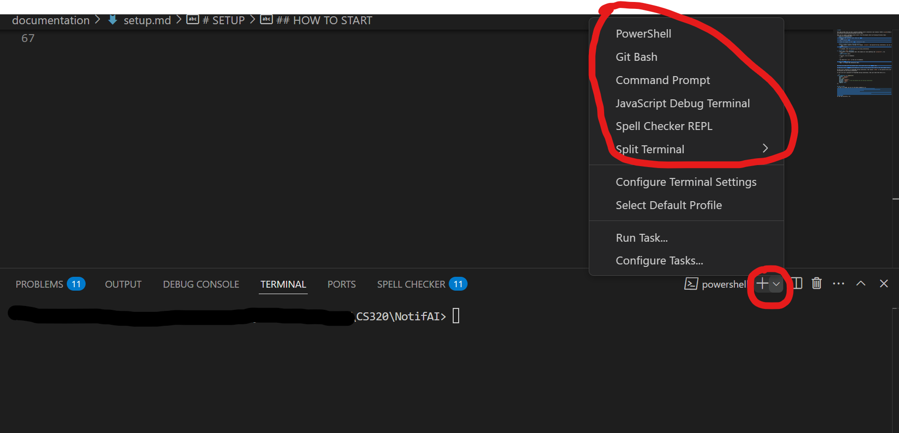

# SETUP

This demo assumes that you have a postgres database server installed on your machine. Here’s a [guide](https://www.w3schools.com/postgresql/postgresql_install.php).

Make sure to create a database called “users” from the postgres shell by following the below steps:
1. Access the PostgreSQL Shell:
   **Option A (Linux/macOS)**  
   - Switch to the `postgres` user, then run `psql`:
     ```bash
     sudo -u postgres psql
     ```
   - You’ll be dropped into the `psql` interactive shell.

   **Option B (Any OS using a specified user)**  
   - If you created a specific username (for example, `postgres`) and password during installation, you can run:
     ```bash
     psql -U postgres
     ```
   - If prompted, enter the password you set during installation.  

2. **Create the `users` Database**
   - Once you’re in the PostgreSQL shell (the prompt will look something like `postgres=#`), run:
     ```sql
     CREATE DATABASE users;
     ```
   - To verify, list all databases:
     ```sql
     \l
     ```
   - You should see `users` in the list of databases.

3. **Exit the psql Shell**  
   - Type `\q` to quit the interactive shell.


Now that we're done with the postgres part, lets switch over to our NotifAI Repo

In the db.js file (./NotifAI/server/db/db.js), scroll to the section thats shown in the code segment below.

If you've not set a password for PostgreSQL during installation, then just leave that entry as is.

If you've set a password for PostgreSQL during installation, then replace `256325` in the password entry with the password you set during installation.
- If you choose to change the password, ensure that you do not accidentally upload it to GitHub when committing your changes.


```js
const sequelize = new Sequelize({ 
    dialect: 'postgres',
    host: 'localhost',
    port: 5432,
    username: 'postgres',
    password: '256325', // Use the password you set during installation
    database: 'users',
    logging: false,
});
```

## HOW TO START
- If you're in **MacOS**, you can run the below commands as is.
- If you're in **Windows**, you'll have to install Git Bash to run these scripts
    - Open VSCode and navigate to the terminal.
    - Below is a picture of a standard VSCode Terminal
    
    - Click the plus (+) icon in the terminal panel, and from the dropdown, select Git Bash instead of PowerShell as shown in the below picture
    
    - Choose Git Bash and it will open up a git bash terminal for you
    - For this project, you’ll need two Git Bash terminals. Repeat the steps above to open a second terminal.

In the root directory, run:
```bash
./installation.sh
```
Then run:
```bash
./start_backend.sh
```
Then in another terminal run:
```bash
./start_frontend.sh
```


## Further Reading:
[Overview](../README.md#overview)                                   
[Code Explanation](./code_explanation.md)